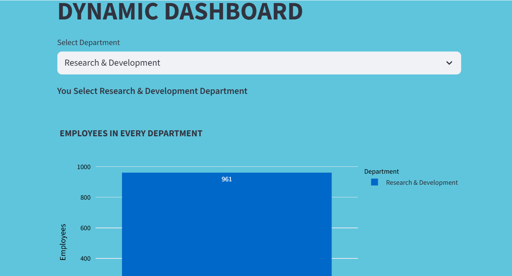

# 📊 HR Analytics Dashboard
An interactive HR analytics dashboard that transforms **IBM’s HR dataset** into actionable insights with **Python**, **SQL**, and **Streamlit**, empowering managers to explore data and manage employees with ease.

---

## Table of Contents
- [Visual Demo](#visual-demo)  
- [Project Overview](#project-overview)  
- [Data Source & Dictionary](#data-source--dictionary)  
- [Data Analysis Purpose](#data-analysis-purpose)  
- [Features](#features)  
- [Technology Stack](#technology-stack)  
- [Installation](#️-installation)  
- [Author](#author)  
- [License](#license)

---

## 📷 Visual Demo

<<<<<<< HEAD

=======

>>>>>>> 99d83a3148aaf3feea884a8e1ee44a2ca52ec3bc

---

## 📖 Project Overview

An interactive HR analytics dashboard built with **Python** and **Streamlit** using IBM’s HR dataset.  
The main goal of this project was to analyze HR data and answer key business questions using Python (Pandas) and SQL.
The dashboard provides insights into employee data, allows HR managers to explore key metrics, and includes simple employee management features.  
Data analysis was performed using **Python and SQL**, and the dashboard was built with **Streamlit**.

---

## 📊 Data Source & Dictionary

### Dataset
The project uses the IBM HR Analytics Employee Attrition & Performance dataset.
🔗 Dataset URL: [Kaggle - IBM HR Analytics](https://www.kaggle.com/datasets/pavansubhasht/ibm-hr-analytics-attrition-dataset)

### Key columns
| Column | Description |
|---|---|
| `EmployeeNumber` | Unique employee ID |
| `Department` | Department name |
| `JobRole` | Employee role |
| `MonthlyIncome` | Monthly salary (numeric) |
| `Age` | Age in years |
| `EducationField` | Education domain |
| `PerformanceRating` | HR performance rating |
| `YearsAtCompany` | Tenure in years |
| `OverTime` | Y/N overtime flag |

---

## 📉 Data Analysis Purpose

This project was built to answer important business questions from the HR dataset, such as:
- Q1/ How many total employees are there?
- Q2/ What is the employee count for each department?
- Q3/ What is the average monthly income by job role?
- Q4/ Who are the top 5 employees by performance rating?
- Q5/ Which department has the highest average performance rating?
##### EXTRA QUESTIONS
- Q6/ What Average age of employees for each Department?
- Q7/ What Average monthly income by gender ?
- Q8/ What is the average monthly income by education level?
- Q9/ Which job role works the most overtime?
- Q10/ What Average years at company by department ?
- Q11/ What Average monthly income by job level ?
- Q12/ Performance rating by years at company (loyalty vs performance) ?

---

## 🚀 Features
- **Multi-tabs:** Organized navigation across pages.  
- **Dynamic Dashboard:** Interactive charts and KPIs filtered by department.  
- **Employee Management:** Add new employees or update salary with validation.  
- **Consistent Styling:** Unified design across all charts for a clean look.  
- **User-Friendly:** Simple, attractive, and easy to use.

---

## 🛠 Technology Stack

### 🔧 Technologies
- **Python 3.10** – Core programming language  
- **SQLite3** – Lightweight relational database  
- **Streamlit** – Web framework for building interactive dashboards  

### 📦 Libraries
- `Pandas` – Data manipulation and analysis  
- `Plotly Express` – Interactive data visualization

---

## ⚙️ Installation
- **IN TERMINAL**

1. Clone the repository:
   ```bash
   git clone https://github.com/ibrahim-alatyan/HR_Analysis_DASHBOARD.git
   cd HR_Analysis_DASHBOARD

2. Install the required libraries:
    ```bash
    pip install -r requirements.txt

3. Run the app:
    ```bash
    streamlit run app.py

    OR

    python -m streamlit run app.py

---

## 👨‍💻 Author
- Ibrahim Al-Atyan

---

## 📄 License
This project is released under the **MIT License**.  
See the [LICENSE](LICENSE) file for more details.
